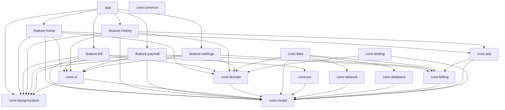

# BillSlice Architecture

Last updated: 2026-08-14

This document defines the target multi-module architecture for BillSlice. It is based on `PRODUCT.md` and the project-local Modern Android Development skill.

No code module should be created only because the architecture names it. Modules should be introduced when their behaviour is needed by the current product version.

## Current Implementation

The implemented app shell contains these inward dependency paths:

```text
:app -> :feature:home -> :core:designsystem
     -> :feature:settings -> :core:designsystem
     -> :feature:bill -> :core:designsystem
                      -> :core:domain -> :core:model
                      -> :core:model
     -> :core:designsystem

:core:ui -> :core:designsystem
```

- `:app` owns `MainActivity`, local startup states, typed Navigation 3 routes, adaptive top-level navigation, theme entry, and feature wiring.
- `:feature:home` owns the offline-ready Home UI, optional quota display, empty/recent bill summaries, and bill-flow navigation intents.
- `:feature:settings` owns typed Settings state and UI for currency, quota, privacy, Pro/restore availability, and build information.
- `:feature:bill` owns manual bill splitting flow, review, people, assignments, calculation, split results, and share preview.
- `:feature:history` owns the local bill history UI, recent bills, Free/Pro visibility boundaries, and tap-to-reopen affordances.
- `:core:database` owns the local Room database, versioned schemas, entities, and transactions.
- `:core:data` owns repository implementations and database-to-domain mapping.
- `:core:designsystem` owns the light-only BillSlice palette, bundled Funnel Sans typography, shapes, spacing, and semantic theme tokens.
- `:core:ui` is present for shared UI components.
- `:core:domain` and `:core:model` are pure Kotlin modules for business logic, validation, calculation, and domain seams.

## Architecture Principles

BillSlice follows Modern Android Development principles:

- Multi-layered architecture: UI, Domain, and Data.
- Unidirectional Data Flow: state flows down, events flow up.
- Reactive state with `Flow` and `StateFlow`.
- Jetpack Compose and Material 3 for UI.
- Hilt for dependency injection.
- Constructor injection for testability.
- Domain logic in pure Kotlin where possible.
- Feature modules depend on core modules, not on each other.

The design goal is deep modules: small interfaces with meaningful behaviour behind them. The important seams should be stable and testable:

- Bill calculation.
- Bill editing/session state.
- Local bill history.
- Smart Scan parsing.
- Entitlement and quota checks.
- Sharing output.
- Ads visibility.

## Target Module Graph



## Dependency Rule

Dependencies point inward toward stable product logic.

Allowed:

- `:app` depends on feature modules and app-level wiring.
- Feature modules depend on core modules.
- `:core:data` implements repository interfaces defined in `:core:domain`.
- `:core:domain` depends only on `:core:model` and pure Kotlin dependencies.
- `:core:model` depends on no app-specific module.

Avoid:

- Feature module depending on another feature module.
- Domain depending on Android UI, Room, Retrofit, RevenueCat, AdMob, ML Kit, or Supabase SDKs.
- UI calculating bill totals directly.
- Data models leaking into UI when a domain model is enough.
- External SDKs being called directly from ViewModels.

## Module Responsibilities

### `:app`

The Android application shell.

Responsibilities:

- `MainActivity`.
- App theme entry point.
- Navigation host.
- App-level dependency injection setup.
- Build variant wiring.

Should not contain:

- Bill calculation.
- Repository implementations.
- Smart Scan parsing logic.
- Local database queries.
- Feature screen business logic.

### `:feature:home`

Home entry point.

Responsibilities:

- Start scan/manual bill flow.
- Show recent bills preview.
- Show allowed home ad slot.
- Route to history, paywall, settings, or bill flow.

### `:feature:bill`

The active bill splitting flow.

Responsibilities:

- Receipt import/camera entry screen.
- OCR progress state.
- Receipt review/edit screen.
- Participant entry.
- Item assignment.
- Calculation result.
- Save bill.
- Share text result.

Important rule:

```text
No ads between Scan -> Review -> Add People -> Assign -> Calculate
```

This module owns UI state and user events for the active split flow, but it delegates all bill math to `:core:domain`.

### `:feature:history`

Local bill history.

Responsibilities:

- Show last 5 bills for Free users.
- Show unlimited history for Pro users later.
- Reopen saved bills.
- Show allowed history ad slots.

Should use domain use cases rather than database APIs directly.

### `:feature:paywall`

Lifetime Pro purchase screen.

Responsibilities:

- Show Free vs Pro comparison.
- Trigger RevenueCat purchase/restore.
- Observe Pro entitlement state.

The feature should depend on `:core:billing`, not RevenueCat directly.

### `:feature:settings`

Settings and diagnostics.

Responsibilities:

- Default currency display.
- Typed Smart Scan quota availability.
- Typed Lifetime Pro/restore availability.
- Receipt-image privacy and local-only copy.
- App version/build information.

## Core Modules

### `:core:model`

Pure Kotlin product models.

Examples:

- `Bill`
- `BillItem`
- `Participant`
- `ItemAssignment`
- `Money`
- `CurrencyCode`
- `ReceiptParseResult`
- `SmartScanQuota`
- `Entitlement`

Rules:

- No Android dependency.
- No database annotations.
- No network serialization annotations unless explicitly needed and isolated.
- Values should express product concepts, not SDK concepts.

### `:core:domain`

Pure business logic and repository interfaces.

Primary responsibilities:

- Bill calculation.
- Tax/service/discount allocation.
- Rounding rules.
- Share text generation.
- Smart Scan quota policy.
- History access use cases.
- Receipt parse validation.

Repository interfaces live here because use cases depend on behaviour, not implementation.

Important interfaces:

```kotlin
interface BillRepository
interface SmartScanRepository
interface EntitlementRepository
```

Important use cases:

```kotlin
CalculateBillSplitUseCase
ValidateReceiptTotalsUseCase
GenerateShareTextUseCase
SaveBillUseCase
ObserveRecentBillsUseCase
GetBillUseCase
ParseReceiptFromOcrUseCase
CanUseSmartScanUseCase
```

The deepest module in v0.1 should be bill calculation. Callers provide a confirmed bill draft and receive a deterministic split result.

### `:core:data`

Repository implementations.

Responsibilities:

- Implement domain repository interfaces.
- Coordinate local database, network, billing entitlement, and quota sources.
- Map database/network DTOs to domain models.
- Enforce single source of truth for saved bill data.

Should not contain:

- Compose UI state.
- Navigation.
- Android screen logic.

### `:core:database`

Local persistence.

Responsibilities:

- Room database.
- DAOs.
- Database entities.
- Migrations.

v0.1 stores full editable bill data locally:

- Merchant/title.
- Date/time.
- Participants.
- Items.
- Assignments.
- Tax.
- Service.
- Discount.
- Payer.
- Final totals.
- Currency.
- OCR/AI warnings if useful.

Do not store receipt images by default in v0.1.

### `:core:network`

Network access for Supabase Edge Functions.

Responsibilities:

- Smart Scan parse endpoint client.
- Request/response DTOs.
- Network error mapping.
- Timeout/retry policy.

Initial endpoint:

```http
POST /smart-scan/parse
```

The exact Android/backend wire boundary is [`docs/contracts/smart-scan-api.md`](docs/contracts/smart-scan-api.md).

Backend receives OCR text only.

### `:core:ocr`

On-device OCR adapter.

Responsibilities:

- ML Kit text recognition.
- Image-to-text extraction.
- OCR error mapping.
- Hide ML Kit details behind a small interface.

Interface shape:

```kotlin
interface ReceiptOcr
```

This module should not call OpenAI or Supabase. It extracts text only.

### `:core:billing`

RevenueCat adapter and entitlement state.

Responsibilities:

- RevenueCat initialization.
- Observe Pro entitlement.
- Start lifetime Pro purchase.
- Restore purchase.
- Expose app-level entitlement model.

Feature modules should never call RevenueCat directly.

### `:core:ads`

AdMob adapter and ad visibility policy.

Responsibilities:

- AdMob initialization.
- Test ad unit configuration for v0.1.
- Ad slot composables or wrappers.
- Hide ads when Pro entitlement is active.
- Enforce allowed placement policy.

This module must not decide active bill flow navigation. Feature modules decide where ad slots can appear; `:core:ads` decides how they render and whether they are visible.

### `:core:designsystem`

Material 3 theme and reusable design tokens.

Responsibilities:

- Color scheme.
- Typography.
- Shape scale.
- App theme.
- Shared icons and visual tokens.

### `:core:ui`

Reusable Compose UI building blocks.

Responsibilities:

- Bill amount display.
- Loading/error surfaces.
- Empty states.
- Participant chips.
- Money text field.
- Primary action layout patterns.

Rules:

- Use stateless composables where possible.
- Prefer slot APIs for reusable layout.
- Keep app-specific orchestration in feature modules.

### `:core:common`

Small shared utilities.

Use sparingly. This module can easily become a junk drawer.

Allowed examples:

- Date/time formatting helpers.
- Result wrappers if they are truly shared.
- Coroutine dispatchers provider.

Do not place business logic here.

### `:core:testing`

Shared test fixtures and fakes.

Responsibilities:

- Deterministic bill fixtures.
- Fake repositories.
- Fake entitlement source.
- Fake Smart Scan parser.
- Fake OCR.

This module should support unit, Compose UI, and Maestro setup without leaking production SDKs into tests.

## UDF Screen Pattern

Feature screens should use this shape:

```text
Composable screen
-> sends UiEvent to ViewModel
-> ViewModel calls UseCase
-> UseCase calls Repository interface
-> Repository implementation talks to data source
-> Result returns upward
-> ViewModel emits UiState
-> Composable renders UiState
```

Naming:

- UI state classes end with `UiState`.
- Events end with `UiEvent`.
- Use cases use `Verb` + `Noun` + `UseCase`.

## Key Deep Modules and Seams

### Bill Calculation

Seam:

```kotlin
CalculateBillSplitUseCase
```

Input:

- Confirmed bill draft.
- Participants.
- Assignments.
- Tax/service/discount values.
- Payer.
- Currency.

Output:

- Per-person totals.
- Owes-payer lines.
- Rounded totals.
- Validation warnings.

Rules hidden inside:

- Tax on subtotal plus service.
- Proportional tax allocation.
- Proportional service allocation.
- Proportional receipt-level discount allocation.
- Nearest-rupiah rounding.
- Leftover difference assigned to payer.

This is the highest-priority unit test surface.

### Receipt Parsing

Seam:

```kotlin
ParseReceiptFromOcrUseCase
```

Input:

- OCR text.
- Locale.
- Currency.
- Install ID.

Output:

- Structured receipt draft.
- Warnings.
- Quota result.

Rules hidden inside:

- Smart Scan quota check.
- Backend parsing call.
- Parser error handling.
- Draft validation.

### Local History

Seam:

```kotlin
BillRepository
```

Required behaviour:

- Save editable bill.
- Observe recent bills.
- Reopen bill by ID.
- Limit Free users to last 5 visible bills.
- Support unlimited history for Pro later.

### Entitlement

Seam:

```kotlin
EntitlementRepository
```

Required behaviour:

- Observe Pro status.
- Purchase lifetime Pro.
- Restore purchases.
- Provide entitlement to ads, history, quota, and paywall UI.

### Ads

Seam:

```kotlin
AdVisibilityPolicy
```

Required behaviour:

- Hide all ads for Pro.
- Allow home/history/result-after-total placements.
- Disallow active bill flow interruption.

## Package Naming

Base package:

```text
com.dimasarya.billslice
```

Suggested module package roots:

```text
com.dimasarya.billslice.app
com.dimasarya.billslice.feature.home
com.dimasarya.billslice.feature.bill
com.dimasarya.billslice.feature.history
com.dimasarya.billslice.feature.paywall
com.dimasarya.billslice.feature.settings
com.dimasarya.billslice.core.model
com.dimasarya.billslice.core.domain
com.dimasarya.billslice.core.data
com.dimasarya.billslice.core.database
com.dimasarya.billslice.core.network
com.dimasarya.billslice.core.ocr
com.dimasarya.billslice.core.billing
com.dimasarya.billslice.core.ads
com.dimasarya.billslice.core.designsystem
com.dimasarya.billslice.core.ui
com.dimasarya.billslice.core.common
com.dimasarya.billslice.core.testing
```

## Implementation Phases

### Phase 1: Core Product Logic

Create only the modules needed to test and build the manual golden path:

- `:core:model`
- `:core:domain`
- `:core:testing`
- `:feature:bill`

Deliver:

- Bill models.
- Calculation use case.
- Validation use case.
- Share text use case.
- Deterministic test fixture.
- Unit tests for expected split:

```text
Dimas: Rp46.200
Arya: Rp69.300
Budi: Rp103.950
Combined: Rp219.450
```

### Phase 2: Local App Shell and History

Add:

- `:core:database`
- `:core:data`
- `:feature:home`
- `:feature:history`
- `:core:designsystem`
- `:core:ui`

Deliver:

- Save bill.
- Reopen bill.
- Last 5 bills for Free.
- Home and history surfaces.
- Maestro golden path without OCR/camera/network.

### Phase 3: Smart Scan

Add:

- `:core:ocr`
- `:core:network`

Deliver:

- ML Kit OCR adapter.
- Supabase Edge Function client.
- Automatic AI parsing after OCR.
- Editable review screen receives structured draft.
- Manual fallback remains available.

### Phase 4: Monetization and Ads

Add:

- `:core:billing`
- `:feature:paywall`
- `:core:ads`

Deliver:

- RevenueCat Pro entitlement.
- Lifetime Pro purchase flow.
- Test AdMob placements.
- Hide ads for Pro.
- Smart Scan quota UI.

### Phase 5: Polish and Release

Deliver:

- Store-ready UI states.
- App size measurement.
- Shipaton demo receipt mode.
- Shipaton demo video flow.
- Release build checks.

## Testing Architecture

Unit tests:

- Prefer pure Kotlin tests in `:core:domain`.
- Use `:core:testing` fixtures.
- Test business rules through use case interfaces.

Compose UI tests:

- Test feature screen state rendering.
- Use fake use cases or fake repositories.
- Match with semantics first; use test tags when semantics are not enough.

Maestro:

- Keep the main golden path deterministic.
- Do not include OCR, AI, RevenueCat, ads, or camera in the golden path.
- Use a test receipt fixture.

Golden path:

```text
Launch
-> open test receipt
-> review items
-> add 3 people
-> assign items
-> calculate
-> verify totals
-> save
-> reopen from history
```

## Backend Boundary

The Android app and Supabase backend meet only at `:core:network`.

Backend-owned:

- OpenAI API key.
- Smart Scan quota persistence.
- Parse logs.
- Server-side parse prompt/schema.

Android-owned:

- Receipt image.
- ML Kit OCR.
- Editable review.
- Bill calculation.
- Local history.
- Sharing.

The original receipt image must stay on device in v0.1.

## Architecture Non-Goals for v0.1

- No KMP.
- No dynamic feature delivery.
- No separate module for every screen.
- No cloud history module.
- No account/auth module.
- No payment settlement module.
- No receipt image sync module.

Add these only when the roadmap reaches them.
