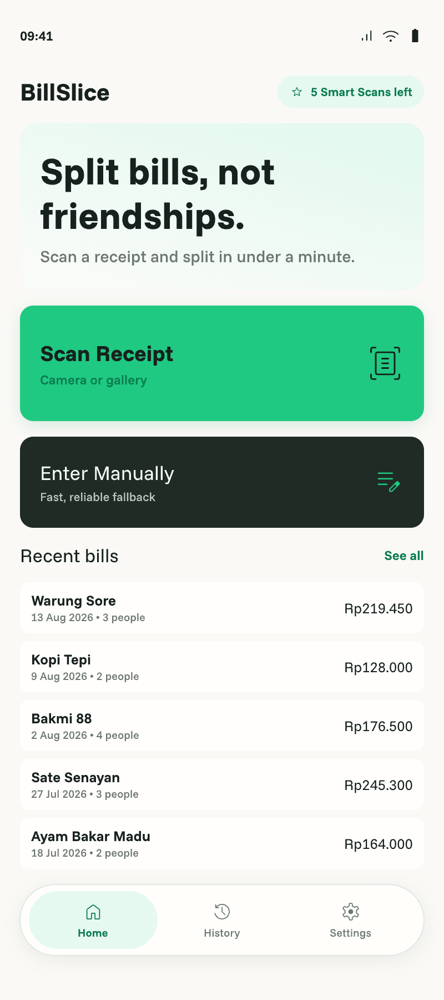
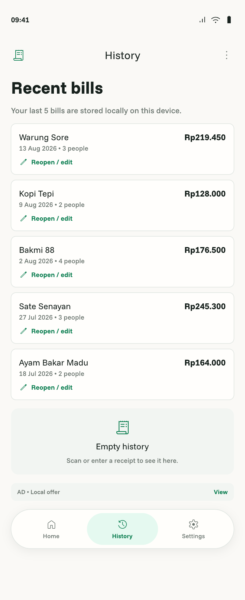
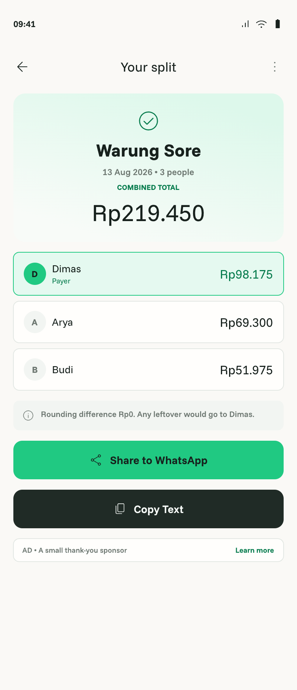

# Ads

- Status: Draft
- Owner: Human
- Last updated: 2026-08-14

## Context

v0.1 permits small AdMob placements outside the active split flow and requires test identifiers until production approval. `:core:ads` owns AdMob rendering/visibility behavior, entitlement hides ads, and feature modules choose only approved slots ([`ARCHITECTURE.md`](../../ARCHITECTURE.md)). Ads are not a navigation feature or a prerequisite for any bill action.

## Outcome

Free closed-test builds may show resilient test ads only on Home, History, or Result after totals, while Pro users and all focused split screens make no visible ad request/surface and ad failure never harms the core flow.

## Reference host screens

| Home | History | Result after totals |
|---|---|---|
|  |  |  |

These Pencil exports identify the only eligible host screens; they do not mandate an ad or approve placement over existing content. `FR-002`–`FR-008` govern whether and where a test ad may render.

## User scenarios

- Free Home/History or post-total Result → allowed test ad may render without displacing primary content.
- Active Pro → no ad request or surface.
- No-fill/offline/load error → content remains complete and actionable with no empty tappable placeholder.

## Functional requirements

- `FR-001` — Development/closed-test builds use Google test ad identifiers only; production identifiers require separate approved configuration.
- `FR-002` — Allowed placements are Home, History (maximum one or two visible placements), and Result only after totals are visible.
- `FR-003` — Ads are forbidden on Splash, Capture, Smart Scan loading, Review, Manual Entry, Add People, Assign Items, Calculation Summary, Share Preview, Settings, and Lifetime Pro.
- `FR-004` — `AdVisibilityPolicy` combines typed placement and entitlement; active Pro suppresses all ad requests and surfaces.
- `FR-005` — `:core:ads` owns AdMob initialization/rendering/error mapping; it must not own navigation or active-flow state.
- `FR-006` — Feature modules declare approved slots but do not call AdMob directly or decide entitlement behavior independently.
- `FR-007` — Loading/no-fill/offline/failure must not block, cover, shift critical content unexpectedly, or leave a misleading/tappable empty region.
- `FR-008` — Ads must never delay totals, calculation, save, share, navigation, or manual fallback.
- `FR-009` — No production ad identifier, secret, private bill/receipt data, or sensitive targeting/log content is committed or emitted.

## Business rules and invariants

No ads between Scan → Review → Add People → Assign → Calculate; Result totals precede ads. No interstitial, app-open, rewarded, or pre-share ads. Pro hides all ads ([`PRODUCT.md`](../../PRODUCT.md), “Ads”; [`docs/product-plan.md`](../product-plan.md), “Ads”).

## States and failure behavior

Cover suppressed-by-placement, suppressed-by-Pro, loading, rendered, no-fill, offline, SDK failure, and configuration failure. Every non-rendered state collapses safely and never changes feature success/failure.

## UX requirements

Ads remain visually secondary, accessible, and clearly distinguishable from BillSlice controls. They cannot obscure totals/actions, steal logical traversal, or violate adaptive layouts. Actual test-ad rendering must be inspected in real app, not only previewed.

## Data and boundary contracts

Input is typed placement plus entitlement. Output is visible/suppressed ad state. `:core:ads` is the only AdMob adapter; feature slots are callers. No bill/receipt/OCR data is provided to the adapter beyond unavoidable platform context.

## Acceptance criteria

- `AC-001` — Covers `FR-001`, `FR-009`: Build/config review finds test IDs only and no prohibited data.
- `AC-002` — Covers `FR-002`, `FR-003`: Placement matrix tests allow only Home/History/post-total Result.
- `AC-003` — Covers `FR-004`: Pro policy tests prove no request/surface.
- `AC-004` — Covers `FR-005`, `FR-006`: Dependency/source inspection proves adapter ownership and no feature direct SDK calls.
- `AC-005` — Covers `FR-007`, `FR-008`: Loading/no-fill/offline/failure tests preserve all primary content/actions.
- `AC-006` — Free/Pro and failure states pass actual-app phone/tablet/accessibility inspection.
- `AC-007` — Targeted policy/UI tests, compile, lint/build, CI, and complete-diff review pass.

## Non-goals

Production ad rollout, revenue analytics, consent-system expansion beyond legally required SDK behavior, interstitial/app-open/rewarded ads, new placements, or ad-driven navigation.

## Assumptions

Closed test uses Google test units. An allowed placement may remain unused if it harms layout; “allowed” does not mean mandatory.

## Open decisions

None.

## Verification matrix

| Acceptance criterion | Evidence required | Proposed verification |
|---|---|---|
| `AC-001` | Safe config | Build/diff/secret inspection |
| `AC-002` | Placement | Pure placement matrix tests |
| `AC-003` | Pro suppression | Entitlement policy tests |
| `AC-004` | Ownership | Dependency/source review |
| `AC-005` | Failure resilience | Fake/no-fill/offline Compose tests |
| `AC-006` | Actual UI | Phone/tablet test-ad screenshots |
| `AC-007` | Gates/review | Gradle/Fastlane/CI and fresh review |
