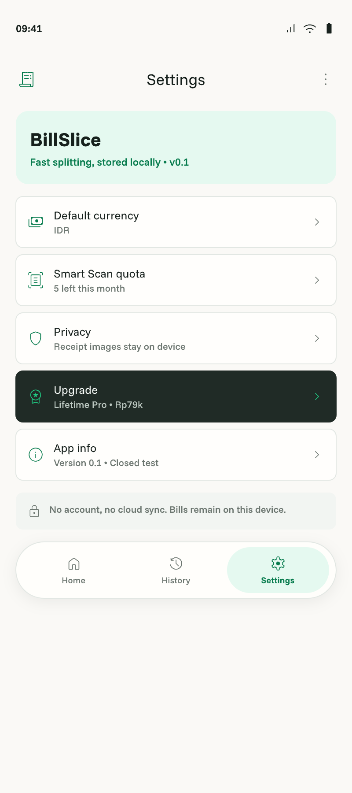

# App shell

- Status: Draft
- Owner: Human
- Last updated: 2026-08-14

## Context

The current app launches the Android Studio greeting with the starter purple/dynamic/dark theme. BillSlice needs the shared shell represented by Splash, Home, and Settings in [`billslice.pen`](../../billslice.pen). [`ARCHITECTURE.md`](../../ARCHITECTURE.md) assigns startup, navigation, theme entry, and wiring to `:app`; Home and Settings belong to separate feature modules; design tokens belong to `:core:designsystem` and proven shared UI to `:core:ui`.

## Outcome

Users can launch BillSlice offline, reach Home, start either scan or manual splitting, and navigate among Home, History, and Settings through an accessible adaptive shell that applies the approved BillSlice visual system without containing feature business logic.

## Reference screens

| Splash | Home | Settings |
|---|---|---|
|  |  |  |

These exports are implementation references from `billslice.pen`; responsive and accessibility behavior remains governed by this specification and `DESIGN.md`.

## User scenarios

- Given a cold offline launch, when local initialization completes, then Splash transitions to Home without requesting an account, purchase, network, camera permission, or receipt.
- Given Home, when the user selects Scan Receipt or Enter Manually, then the app routes to the corresponding bill-flow entry without duplicate navigation.
- Given Settings, when state is available, then default currency, Smart Scan quota, privacy, Pro/restore entry, and app information are shown through feature-owned state.

## Functional requirements

- `FR-001` — Splash must show while required local startup wiring initializes and must reach Home or a recoverable startup error.
- `FR-002` — Home must expose Scan Receipt and Enter Manually as peer primary actions and provide routes to History, Settings, and Lifetime Pro where applicable.
- `FR-003` — Top-level navigation must expose Home, History, and Settings and must not appear as an interactive destination bar inside focused bill-flow screens.
- `FR-004` — `:app` must own `MainActivity`, application startup, navigation host, app theme entry, dependency wiring, and build-variant configuration, but no bill, storage, OCR, billing, or ad business logic.
- `FR-005` — `:feature:home` and `:feature:settings` must not depend on another feature module; navigation between features is composed by `:app`.
- `FR-006` — The light-only BillSlice palette, Funnel Sans typography, shapes, spacing, and semantic tokens from [`DESIGN.md`](../../DESIGN.md) must replace starter purple, automatic dynamic color, and automatic dark theme.
- `FR-007` — `:core:ui` may contain a UI pattern only after at least two screens need it; feature orchestration must remain outside shared UI.
- `FR-008` — Settings must show current default currency, quota/reset state, receipt-image privacy copy, Pro/restore entry or active status, and version/build information; unavailable optional SDK state must not block the screen.
- `FR-009` — Startup and navigation side effects must not duplicate because of recomposition, rotation, restoration, or repeated taps.
- `FR-010` — Shell content must preserve edge-to-edge insets, IME behavior, large-font usability, long text, and compact/medium/expanded layouts.

## Business rules and invariants

- Manual entry is a first-class Home action, not an error-only fallback ([`PRODUCT.md`](../../PRODUCT.md), “Core Flow”).
- Home, History, and Settings are the only top-level destinations ([`DESIGN.md`](../../DESIGN.md), “Navigation”).
- Ads are not implemented here; later ad surfaces must obey the active-flow prohibition in [`PRODUCT.md`](../../PRODUCT.md).
- Default currency is IDR, but no FX or mixed-currency behavior is introduced ([`docs/product-plan.md`](../product-plan.md), “Currency”).

## States and failure behavior

Cover initializing, ready, offline-ready, empty recent-bill context, optional-state unavailable, recoverable startup failure, and unrecoverable configuration failure. Optional billing, ad, quota, or recent-history failures must degrade their own content without blocking Home or manual entry.

## UX requirements

Match Splash, Home, Settings, top bar, and bottom navigation in `billslice.pen`; use general tokens and component-state rules from `DESIGN.md`. All actions need meaningful semantics, non-color state cues, logical traversal, and 48dp touch targets. Compact layouts use the designed bottom navigation; larger layouts may adapt navigation placement without adding destinations.

## Data and boundary contracts

Inputs are startup state and domain-facing summaries for recent bills, quota, entitlement, default currency, and build information. Outputs are navigation intents only. `:app` composes feature interfaces; it does not reach into repositories or SDKs. This feature persists no receipt or bill data and introduces no external-service call.

## Acceptance criteria

- `AC-001` — Covers `FR-001`, `FR-009`: Offline cold launch reaches Home once; rotation/repeated taps do not duplicate navigation.
- `AC-002` — Covers `FR-002`, `FR-003`: All approved destinations and both bill entry actions are reachable with correct focused-flow navigation behavior.
- `AC-003` — Covers `FR-004`, `FR-005`, `FR-007`: Module/dependency inspection shows app-owned wiring, no feature-to-feature edge, and no shared-UI orchestration.
- `AC-004` — Covers `FR-006`: Actual app uses the approved light BillSlice theme with no starter purple, dynamic color, or invented dark theme.
- `AC-005` — Covers `FR-008`: Settings renders live/default/unavailable states without blocking navigation.
- `AC-006` — Covers `FR-010`: Phone, large-font, landscape, and tablet inspection finds no clipped primary action or inaccessible navigation.
- `AC-007` — Covers all requirements: targeted UI/navigation tests, affected compilation, lint, assembly, actual-app evidence, and complete-diff review pass.

## Non-goals

Bill editing/calculation, history persistence, Smart Scan processing, purchase implementation, ad rendering, accounts, cloud sync, dark theme, or dynamic feature delivery.

## Assumptions

The Pencil screens are approved visual direction. Settings rows may initially show typed unavailable states until their owning features land. Default currency display is IDR.

## Open decisions

None.

## Verification matrix

| Acceptance criterion | Evidence required | Proposed verification |
|---|---|---|
| `AC-001` | Startup/idempotence | Navigation integration test; offline actual-app launch |
| `AC-002` | Route behavior | Compose navigation tests and manual inspection |
| `AC-003` | Dependency ownership | Gradle dependency report and source review |
| `AC-004` | Theme fidelity | Theme tests and actual-app screenshot |
| `AC-005` | Settings states | ViewModel/Compose tests |
| `AC-006` | Adaptive/accessibility | `Medium_Phone_API_36`, large font/landscape, and `Pixel_Tablet` inspection |
| `AC-007` | All gates | Targeted tests, compile, `lintDebug`, `assembleDebug`, diff review |
