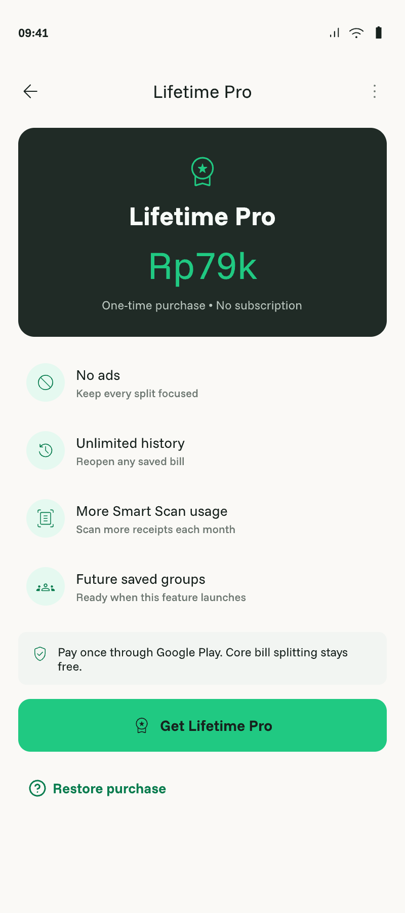

# Lifetime Pro

- Status: Draft
- Owner: Human
- Last updated: 2026-08-14

## Context

v0.1 monetization is Free plus a one-time Lifetime Pro purchase, with no subscription. The Lifetime Pro screen exists in `billslice.pen`. `:feature:paywall` owns UI, `:core:billing` owns the RevenueCat adapter, and entitlement is exposed through a domain-facing seam to History, Smart Scan, Settings, and ads ([`ARCHITECTURE.md`](../../ARCHITECTURE.md)).

## Outcome

Users can understand, purchase, observe, and restore Lifetime Pro without an account; verified entitlement updates Pro capabilities while cancellation/failure leaves all Free functionality usable.

## Reference screen

The displayed `Rp79k` is visual hypothesis copy. Runtime acceptance requires the localized store price defined by `FR-002`.

## User scenarios

- Offering loads → screen shows store-localized lifetime price/benefits → purchase succeeds → entitlement becomes active.
- Purchase is pending/cancelled/fails/already owned → accurate non-destructive state.
- Restore succeeds or finds nothing → Settings/paywall reflect result without blocking Free use.

## Functional requirements

- `FR-001` — Lifetime Pro must explain one-time purchase and current benefits: no ads, unlimited locally retained history, more/fair-use Smart Scans, and roadmap-consistent Pro value without promising unimplemented features as active.
- `FR-002` — Displayed price/currency must come from the active store/RevenueCat offering for `pro_lifetime`, not a hardcoded `Rp79k` production value.
- `FR-003` — Purchase states must include offering loading/unavailable, ready, purchasing, pending, success, cancellation, failure, already-owned, and active.
- `FR-004` — Restore states must include restoring, restored active, nothing to restore, and failure.
- `FR-005` — RevenueCat entitlement `pro` is observed through `EntitlementRepository`; feature ViewModels/screens never call RevenueCat directly.
- `FR-006` — Anonymous install ID equals RevenueCat app user ID; no account is required.
- `FR-007` — Free retains unlimited manual splitting, text sharing, five monthly Smart Scans, and five recent bills; active Pro exposes all locally retained history and suppresses ads.
- `FR-008` — Entitlement updates propagate reactively to paywall, Settings, History policy, Smart Scan policy, and ad policy without app restart.
- `FR-009` — Cancellation, SDK/network failure, missing offering, or stale cached entitlement must not block Free use or falsely claim purchase success.
- `FR-010` — No RevenueCat secret, service credential, private purchase data, or production diagnostic detail is committed or logged.

## Business rules and invariants

Lifetime only; no subscription in v1.0 ([`PRODUCT.md`](../../PRODUCT.md), “Monetization”). `pro` and `pro_lifetime` names follow [`docs/product-plan.md`](../product-plan.md). Smart Scan Pro allowance is generous/fair-use rather than promised unlimited unless backend policy later says so. Manual splitting remains Free.

## States and failure behavior

Cover offering load/unavailable, purchase ready/purchasing/pending/active/cancelled/failed/already-owned, restore working/restored/nothing/failure, offline, and cached entitlement. Cancellation is not an alarming error; optional SDK failure does not block the app shell.

## UX requirements

Match Lifetime Pro and Settings states in `billslice.pen`/`DESIGN.md`; show localized price, benefit status, purchase/restore progress, disabled/loading actions, accessible semantics, and legal/store text where required. Do not hardcode unverified active benefits.

## Data and boundary contracts

Inputs are install ID, RevenueCat offering/customer info, purchase/restore actions. Output is domain `Entitlement` and typed billing outcomes. `:core:billing` is the only SDK adapter; `:app` initializes/wires it. Purchase truth comes from RevenueCat/Play, not local flags.

## Acceptance criteria

- `AC-001` — Covers `FR-001`, `FR-002`: Paywall shows accurate implemented benefits and store-localized lifetime price.
- `AC-002` — Covers `FR-003`, `FR-009`: Tests/sandbox evidence cover load, purchase, pending, success, cancellation, failure, already-owned, and active.
- `AC-003` — Covers `FR-004`: Restore active/nothing/failure states behave accurately.
- `AC-004` — Covers `FR-005`, `FR-006`: Dependency/source inspection proves SDK isolation and stable anonymous identity.
- `AC-005` — Covers `FR-007`, `FR-008`: Entitlement policy/reactivity tests update History, quota, Settings, and ads without restart while preserving Free access.
- `AC-006` — Covers `FR-010`: Secret/log/artifact review finds no prohibited data.
- `AC-007` — Paywall/Settings pass actual-app adaptive/accessibility and RevenueCat sandbox inspection.
- `AC-008` — Targeted tests/compile, lint/build, CI, and complete-diff review pass.

## Non-goals

Subscriptions, accounts, production price decisions, cloud value, saved groups, image cards, or claiming future advanced split features as implemented.

## Assumptions

`Rp79k` in Pencil is hypothesis copy; runtime uses localized offering. Required test offering exists as an implementation precondition.

## Open decisions

None.

## Verification matrix

| Acceptance criterion | Evidence required | Proposed verification |
|---|---|---|
| `AC-001` | Benefits/price | Fake offering UI test and sandbox actual app |
| `AC-002` | Purchase states | Adapter/fake tests and sandbox purchase |
| `AC-003` | Restore states | Adapter/UI tests and sandbox restore |
| `AC-004` | Seam/identity | Dependency/source review |
| `AC-005` | Reactive policy | Domain/integration tests |
| `AC-006` | Security | Secret/log/artifact diff review |
| `AC-007` | UX | Phone/tablet actual-app evidence |
| `AC-008` | Gates | Gradle/Fastlane/CI and fresh review |
