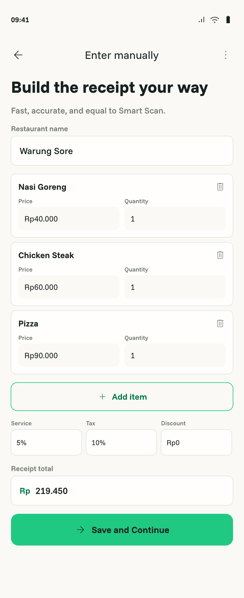
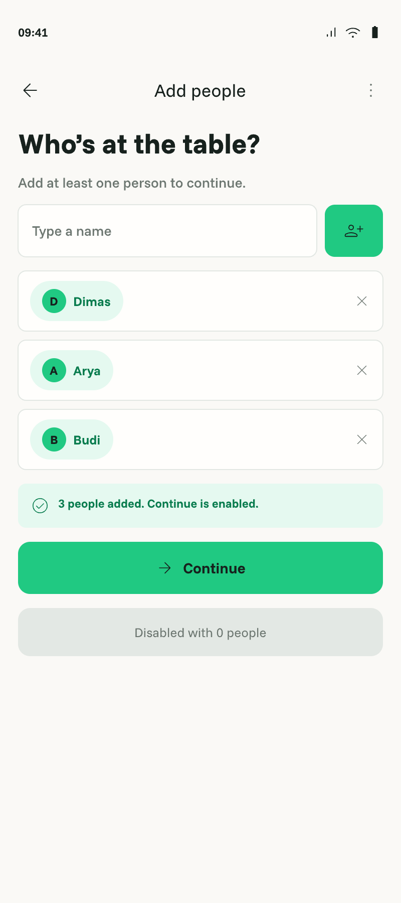
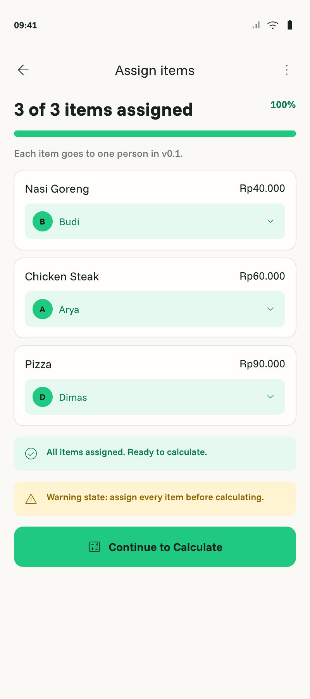
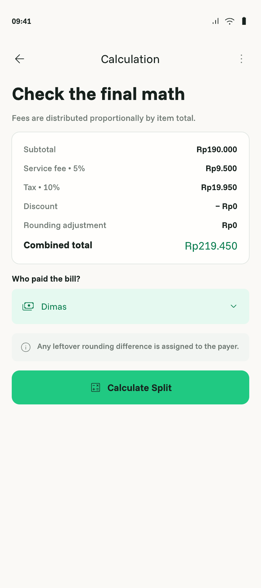
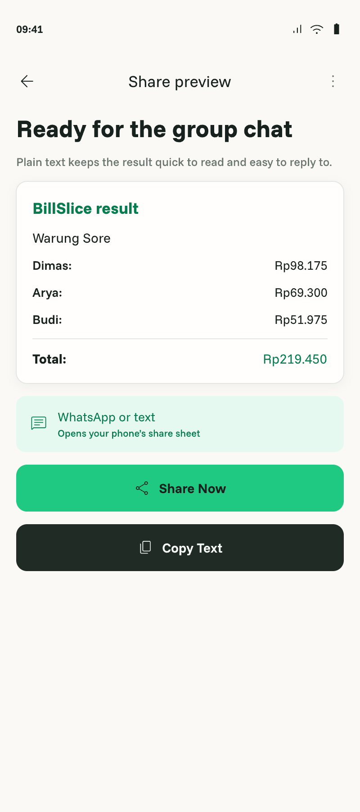

# Manual bill splitting

- Status: Approved
- Owner: Human
- Last updated: 2026-08-14

## Context

Manual splitting is the reliable v0.1 core and the required fallback when Smart Scan fails. It covers Manual Item Entry, Add People, Assign Items, Calculation Summary, Split Result, and Share Preview in `billslice.pen`. `:feature:bill` owns UI/session state while exact models, calculation, validation, and share generation belong to pure `:core:model`/`:core:domain` ([`ARCHITECTURE.md`](../../ARCHITECTURE.md)).

The owner resolved the fixture conflict: every v0.1 item has one owner. Shared Pizza allocation is removed from the canonical fixture.

## Outcome

Offline, a user can manually enter a bill, add participants and one payer, assign each item to one owner, calculate exact proportional charges, review totals, and copy/share a WhatsApp-friendly result without OCR, network, billing, or ads.

## Reference screens

| Manual Item Entry | Add People | Assign Items |
|---|---|---|
|  |  |  |

| Calculation Summary | Split Result | Share Preview |
|---|---|---|
|  |  |  |

The exported Assign/Result/Share samples contain stale shared-Pizza totals. Their visual structure is approved, but implementation content must use the one-owner fixture and totals in `FR-005` and `AC-003`.

## User scenarios

- Given the canonical bill, when Dimas owns Nasi Goreng `Rp40.000`, Arya owns Chicken Steak `Rp60.000`, Budi owns Pizza `Rp90.000`, service is 5%, tax is 10%, discount is zero, and Dimas pays, then totals are Dimas `Rp46.200`, Arya `Rp69.300`, Budi `Rp103.950`, combined `Rp219.450`.
- Given invalid input, missing payer/people, or unassigned items, calculation is blocked with actionable validation.
- Given a receipt-total mismatch, the user sees a non-blocking warning and calculation uses confirmed items/service/tax/discount.
- Given Share Preview, copy/share cancellation returns without altering the draft/result.

## Functional requirements

- `FR-001` — A draft must contain stable ID, merchant/title, date/time, one currency, items, participants, one-owner assignments, one payer, service, tax, receipt-level discount, optional receipt total, warnings, and derived result.
- `FR-002` — Manual Entry must add/edit/remove items and edit merchant, quantity, exact unit price/subtotal, rates/amounts, discount, currency, and optional receipt total.
- `FR-003` — Retained items require non-blank name, positive quantity, non-negative exact price, and deterministic subtotal; invalid text must not silently become zero.
- `FR-004` — Participants require normalized unique non-blank names; at least one participant and exactly one payer are required.
- `FR-005` — Every item must have exactly one owner; shared, weighted, quantity, percentage, or custom participant splits are absent in v0.1.
- `FR-006` — Changing a calculation input invalidates the prior result and requires recalculation.
- `FR-007` — Money/rates use exact deterministic representations, never `Float`/`Double` for money.
- `FR-008` — Formula is subtotal=sum items; service=subtotal×service rate; tax=(subtotal+service)×tax rate; total=subtotal+service+tax−discount.
- `FR-009` — Service, tax, and receipt discount allocate proportionally by each owner’s item subtotal.
- `FR-010` — Exact intermediates are retained; final total and participant totals round to nearest rupiah with half-up ties; leftover goes to payer.
- `FR-011` — Typed validation rejects invalid amounts/rates, negative payable total, zero allocatable subtotal with proportional charges, missing people/payer, and unassigned items.
- `FR-012` — Receipt-total states are `Looks good`, `Needs review`, and `Missing total`; receipt total is validation-only and warnings do not block confirmed calculation.
- `FR-013` — Calculation Summary displays subtotal, service, tax, discount, rounding adjustment when nonzero, combined total, and payer.
- `FR-014` — Result displays every participant amount, payer, owes-payer lines, combined total, and Share action with totals visible first.
- `FR-015` — Share text contains heading, merchant when present, payer, participant amounts/owes lines, total, currency, and tax/service note; copy and Android `text/plain` sharing are supported.
- `FR-016` — Sharing never includes receipt image, OCR text, secret, internal ID, or diagnostics; cancellation/failure preserves the result.
- `FR-017` — Confirmed structured draft state survives configuration change and normal process recreation; coroutine cancellation and duplicate-action prevention are preserved.

## Business rules and invariants

Use one currency per bill, default IDR, no FX. Each item has one owner. Tax is on subtotal plus service; charges/discount allocate proportionally; half-up rupiah rounding and payer remainder apply. Manual splitting and text sharing remain Free and offline. These rules derive from [`PRODUCT.md`](../../PRODUCT.md), [`docs/product-plan.md`](../product-plan.md), and the owner’s one-owner decision.

## States and failure behavior

Cover empty/pristine/dirty, field-invalid, incomplete, valid, calculated, calculated-then-invalidated, warning-only mismatch, calculation failure, share ready/copied/launched/cancelled/failed, restoration, and explicit discard. No failure may erase confirmed input silently.

## UX requirements

Match the six named Pencil screens and `DESIGN.md`. One dominant action per screen; visible progress on assignment; non-color validation; accessible semantics; 48dp targets; locale-aware IDR formatting; edge-to-edge/IME; large font, landscape, long names, and expanded widths.

## Data and boundary contracts

Input is a confirmed structured draft. Output is typed validation, deterministic split result, and plain share text. `CalculateBillSplitUseCase`, `ValidateReceiptTotalsUseCase`, and `GenerateShareTextUseCase` are the test surfaces. No persistence, OCR/network, billing, or ad SDK is owned by this feature.

## Acceptance criteria

- `AC-001` — Covers `FR-001`–`FR-006`: Draft editing, participant/payer validation, one-owner assignment, and stale-result invalidation pass unit/UI tests.
- `AC-002` — Covers `FR-007`–`FR-012`: Pure JVM tests prove formula, proportional allocation, half-up/remainder behavior, typed failures, and receipt-total states.
- `AC-003` — Covers `FR-008`–`FR-010`: Canonical fixture produces Dimas `Rp46.200`, Arya `Rp69.300`, Budi `Rp103.950`, total `Rp219.450`.
- `AC-004` — Covers `FR-013`, `FR-014`: Summary/Result show all required values and no shared-item control or pre-total ad.
- `AC-005` — Covers `FR-015`, `FR-016`: Deterministic copy/share behavior sends only safe `text/plain` content and cancellation preserves state.
- `AC-006` — Covers `FR-017`: Restoration/repeated-action/cancellation tests preserve draft and prevent duplicate calculations/shares.
- `AC-007` — All six screens pass actual-app compact/adaptive/accessibility inspection.
- `AC-008` — Product, plan, architecture, harness, Pencil/app fixtures no longer claim shared Pizza in v0.1.
- `AC-009` — Targeted tests/compile, repository tests, lint, assembly, Fastlane/CI, and complete-diff review pass.

## Non-goals

Smart Scan, save/history, shared/custom splits, accounts/cloud, FX, image sharing, payment settlement, Pro gating, or ads.

## Assumptions

One-owner decision overrides stale shared fixture. Half-up resolves unspecified tie behavior. Receipt total validates but does not override calculated inputs.

## Open decisions

None.

## Verification matrix

| Acceptance criterion | Evidence required | Proposed verification |
|---|---|---|
| `AC-001` | Draft/assignment behavior | Domain/ViewModel and semantic Compose tests |
| `AC-002` | Exact math/failures | `:core:domain` JVM tests |
| `AC-003` | Canonical totals | Unit plus Compose integration test |
| `AC-004` | Summary/result | UI tests and actual app |
| `AC-005` | Safe sharing | Pure text tests and Android intent integration |
| `AC-006` | Restoration/idempotence | State/coroutine tests |
| `AC-007` | UX/adaptive/accessibility | Phone/tablet actual-app screenshots and inspection |
| `AC-008` | Contract consistency | Repository/Pencil fixture review |
| `AC-009` | Gates/review | Gradle, Fastlane/CI, fresh diff review |
