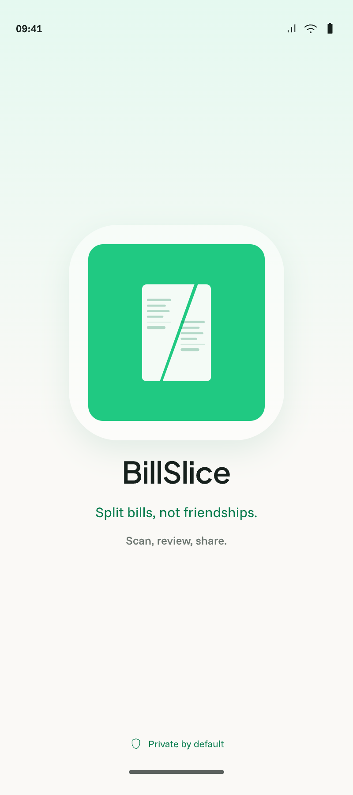

# Skeleton architecture

- Status: Approved
- Owner: Human
- Last updated: 2026-08-14

## Context

BillSlice is currently the default single-module Android Studio Compose project. `settings.gradle.kts` includes only `:app`; the launcher renders `Hello Android!`; the theme is the generated Material purple/dynamic/dark theme; and the local and instrumented tests are generated examples rather than BillSlice acceptance evidence. The current baseline passes `./gradlew help :app:testDebugUnitTest :app:lintDebug :app:assembleDebug`.

The repository already describes a target multi-module system in [`ARCHITECTURE.md`](../../ARCHITECTURE.md), but that document also says modules must be introduced only when current behavior needs them. Its Phase 1 names `:core:model`, `:core:domain`, `:core:testing`, and `:feature:bill`, while the current source has neither domain behavior nor shared fixtures. This specification resolves that tension for the first implementation slice by establishing only one compilable dependency path through the application, bill feature, domain, and model layers. `:core:testing` and all later-phase modules remain deferred until they have concrete behavior or at least two consumers.

The generated theme conflicts with [`DESIGN.md`](../../DESIGN.md), which specifies a deliberately light BillSlice palette and forbids the starter purple palette, automatic dynamic color, and an undesigned dark theme. Correcting the visual system is product UI work and is not silently included in this architecture-only slice.

## Outcome

BillSlice has a minimal, compilable architecture skeleton in which the Android application shell delegates its existing placeholder content to the bill feature, dependencies point inward through pure domain and model modules, the implemented graph is documented, and no speculative product behavior, external integration, or reusable abstraction is introduced.

## Visual context

| Future Splash | Future Home |
|---|---|
|  |  |

These screens show the product context the skeleton will eventually support. They are not acceptance targets for this architecture-only slice, which intentionally preserves the existing placeholder UI.

## User scenarios

### Existing launcher remains usable

Given the skeleton has been applied to a clean, green baseline, when a developer builds, installs, and launches the debug application, then the app opens without crashing and retains the existing placeholder experience with no intentional product-flow or visual redesign.

### A developer locates the next bill-splitting slice

Given a developer needs to add the first BillSlice domain behavior, when they inspect the implemented module graph, then model concepts have an Android-free owner, deterministic business logic has an Android-free owner, active bill UI has one feature owner, and application startup and wiring remain owned by `:app`.

### An invalid dependency is proposed

Given code in `:core:model` or `:core:domain` attempts to depend on Android UI, storage, networking, OCR, billing, advertising, or a feature module, when the affected modules are compiled and their Gradle dependencies are inspected, then the dependency is absent from the approved contract and must be rejected before acceptance.

## Functional requirements

- `FR-001` — The implemented Gradle graph must contain `:app`, `:feature:bill`, `:core:domain`, and `:core:model`.
- `FR-002` — Production dependencies must point inward as `:app` to `:feature:bill`, `:feature:bill` to `:core:domain` and `:core:model`, and `:core:domain` to `:core:model`; no reverse dependency or feature-to-feature dependency may exist.
- `FR-003` — `:core:model` must be an Android-free Kotlin module with no dependency on any other BillSlice module and no SDK, persistence, serialization, or UI annotations.
- `FR-004` — `:core:domain` must be an Android-free Kotlin module and may depend only on `:core:model` plus pure Kotlin test dependencies required by behavior added in a later approved slice.
- `FR-005` — `:feature:bill` must be an Android library module that owns the existing placeholder Compose content exposed to `:app`; it must not define bill calculations, persistence, network calls, OCR, billing, advertising, or application startup.
- `FR-006` — `:app` must remain the only Android application module and must own `MainActivity`, application manifest configuration, application startup, top-level theme application, and wiring to the bill feature.
- `FR-007` — Applying the skeleton must not intentionally change the current launcher copy, interaction, navigation, accessibility semantics, layout, theme behavior, application ID, minimum SDK, target SDK, or version values.
- `FR-008` — The skeleton must not add Hilt, navigation, Room, a network client, ML Kit, Supabase, OpenAI, RevenueCat, AdMob, money libraries, test-fixture modules, convention plugins, or other dependencies without behavior in this slice that requires them.
- `FR-009` — Each included module and the aggregate debug application must compile from the command line, and existing JVM tests, Android lint, and debug assembly must remain green.
- `FR-010` — Repository architecture documentation must distinguish the implemented skeleton graph from the larger target graph after implementation.
- `FR-011` — Generated example tests must not be cited as evidence of BillSlice product behavior or bill-domain correctness.

## Business rules and invariants

This slice implements no bill model, bill calculation, receipt flow, or saved draft. The following established rules constrain ownership and future work but are not claims that those behaviors exist after this slice:

- Bill math, currency, payer, participant, receipt-total validation, proportional allocation, and rounding behavior belong in Android-free model/domain code and must use deterministic exact money rather than `Float` or `Double` ([`docs/agent/android-engineering.md`](../agent/android-engineering.md), “Product-domain invariants”; [`docs/product-plan.md`](../product-plan.md), “Currency” and “Bill Math”). This slice deliberately does not choose a money representation or rounding interface.
- Manual receipt entry remains a first-class fallback and must not later be made conditional on OCR or AI success ([`PRODUCT.md`](../../PRODUCT.md), “v0.1 Closed Test MVP” and “Smart Scan”). No receipt-entry UI is implemented here.
- OCR and AI output remains an editable draft that requires confirmation before assignment. Receipt images stay on-device, the backend may receive OCR text only, and full OCR text is not persisted by default ([`PRODUCT.md`](../../PRODUCT.md), “Smart Scan”; [`docs/product-plan.md`](../product-plan.md), “Smart Scan”). This slice adds no receipt permission, image storage, OCR, logging, or external boundary.
- Full editable bill data is the future local-history contract, while receipt images are not stored by default ([`docs/product-plan.md`](../product-plan.md), “Local History”). This slice adds no persistence or backup contract.
- The active flow remains free of ads from Scan through Calculate ([`PRODUCT.md`](../../PRODUCT.md), “Ads”). This slice adds no ad surface or adapter.

## States and failure behavior

- **Configuration/loading:** Gradle configuration must resolve all four modules without requiring credentials or a network service at application runtime. Normal first-build dependency resolution is an environment prerequisite, not an app loading state.
- **Empty:** The core modules may initially contain no product types or behavior. Empty modules must compile without placeholder marker classes, invented interfaces, or fake business models.
- **Success:** Each module compiles independently, the aggregate debug APK assembles, lint and existing JVM tests pass, and the installed app reaches the existing placeholder content.
- **Validation failure:** A cycle, forbidden outward dependency, Android dependency in a pure module, duplicate application plugin, missing module declaration, or build failure blocks acceptance.
- **Partial data:** Not applicable; the slice reads, writes, and transmits no bill or receipt data.
- **Retry and cancellation:** A failed build may be retried after its deterministic configuration or environment cause is corrected. No runtime retry or cancellation behavior is introduced.
- **Unrecoverable error:** If the app cannot install or launch after the extraction, the skeleton must not be accepted; the smallest rollback is the app-to-feature extraction and associated module declarations.

## UX requirements

This is not a UI redesign. The installed app must retain the existing placeholder content and its user-visible semantics, remain edge-to-edge, and launch without a navigation dead end. Any unavoidable visual difference caused by moving the composable across modules must be treated as a regression.

General future content, interaction, accessibility, adaptive-layout, and navigation rules remain governed by [`DESIGN.md`](../../DESIGN.md) and [`docs/agent/android-engineering.md`](../agent/android-engineering.md). The known starter-theme conflict is explicitly deferred; this slice must not present the placeholder as approved BillSlice design.

## Data and boundary contracts

- **Input:** Android launcher activation only. There is no bill, receipt, payer, participant, currency, or external-service input.
- **Output:** Existing placeholder Compose content and a buildable debug APK. There is no domain result or persisted output.
- **Persistence:** None added. Existing generated Android backup declarations remain unchanged and are not approval for future bill or receipt backup behavior.
- **Module ownership:** `:core:model` owns future product values; `:core:domain` owns future deterministic rules; `:feature:bill` owns the active bill UI surface; `:app` owns startup and composition. These ownership statements follow [`ARCHITECTURE.md`](../../ARCHITECTURE.md) without creating its later-phase modules.
- **External boundaries:** None. No camera, image picker, OCR, backend, database, billing, advertising, analytics, or sharing boundary is introduced.
- **Privacy and security:** The skeleton must contain no credentials, service URLs, production identifiers, receipt fixtures, OCR text, personal data, or new permissions. Receipt images and OCR text never cross a boundary because those boundaries do not exist in this slice.
- **Interface depth:** The slice must not expose speculative repositories, adapters, use cases, or common wrappers. A stable interface is introduced only with behavior and at least production/test variation that makes the seam real.

## Acceptance criteria

- `AC-001` — Covers `FR-001`, `FR-002`: Gradle project inspection shows exactly the approved new skeleton modules and dependency direction, with no cycle or added later-phase BillSlice module.
- `AC-002` — Covers `FR-003`, `FR-004`: `:core:model` and `:core:domain` compile as Android-free Kotlin modules; their build files contain no Android or external-SDK dependency.
- `AC-003` — Covers `FR-005`, `FR-006`, `FR-007`: `MainActivity` remains in `:app`, delegates placeholder rendering to `:feature:bill`, and an installed debug build shows the same placeholder copy and behavior as the baseline.
- `AC-004` — Covers `FR-008`: Version-catalog and module-build-file inspection finds no newly added runtime library except dependencies required to compile the approved Kotlin/Compose module types.
- `AC-005` — Covers `FR-009`: `./gradlew :core:model:compileKotlin :core:domain:compileKotlin :feature:bill:compileDebugKotlin :app:compileDebugKotlin` succeeds.
- `AC-006` — Covers `FR-009`: `./gradlew testDebugUnitTest lintDebug assembleDebug` succeeds after the extraction.
- `AC-007` — Covers `FR-010`: `ARCHITECTURE.md` identifies `:app`, `:feature:bill`, `:core:domain`, and `:core:model` as the implemented skeleton and continues to label the larger graph as target architecture.
- `AC-008` — Covers `FR-008`, `FR-011`: Complete-diff inspection finds no speculative product type, repository, use case, adapter, SDK integration, secret, permission, receipt data, or claim that generated example tests verify BillSlice behavior.

## Non-goals

- Bill models, `Money`, bill calculation, allocation, validation, sharing, or the canonical Dimas/Arya/Budi fixture.
- Home, receipt review, participant, assignment, result, history, paywall, settings, or real navigation UI.
- BillSlice theme/design-system implementation or correction of the starter theme.
- `:core:testing`, `:core:data`, `:core:database`, `:core:network`, `:core:ocr`, `:core:billing`, `:core:ads`, `:core:designsystem`, `:core:ui`, or `:core:common`.
- Hilt, Room, Navigation Compose, ML Kit, Supabase, OpenAI, RevenueCat, AdMob, camera/image import, sharing, analytics, or cloud configuration.
- Production behavior, backend work, credentials, migrations, user accounts, cloud sync, saved groups, receipt galleries, FX conversion, or monetization.
- Refactoring Gradle into convention plugins or changing AGP, Kotlin, Compose, SDK, Java, application ID, or release configuration versions.

## Assumptions

- “Build skeleton architecture” means the first enforceable dependency path, not the complete target graph in `ARCHITECTURE.md`.
- Moving the current placeholder composable into `:feature:bill` is sufficient to prove the app-to-feature dependency without inventing product behavior.
- `:core:testing` is deferred despite being listed in Architecture Phase 1 because there are no shared BillSlice fixtures or multiple consumers yet; creating it empty would conflict with the repository’s anti-speculation rule.
- Hilt is deferred despite being the target dependency-injection mechanism because this slice has no injectable runtime dependency.
- The current generated theme and example tests are evidence of baseline behavior only, not desired BillSlice design or product correctness.
- The baseline commit on `main` is approved and the worktree is clean, so later implementation may use the normal `codex/skeleton-architecture` branch lifecycle.

## Open decisions

None. Any request to include additional modules, product types, dependency injection, theme work, or BillSlice behavior materially expands this specification and requires human approval before implementation.

## Verification matrix

| Acceptance criterion | Evidence required | Proposed verification |
|---|---|---|
| `AC-001` | Included projects and direct project dependencies | Manual inspection of `settings.gradle.kts` and module build files; `./gradlew projects`; dependency report where needed |
| `AC-002` | Pure-module compilation and dependency declarations | `./gradlew :core:model:compileKotlin :core:domain:compileKotlin`; manual build-file inspection |
| `AC-003` | App/feature ownership and unchanged rendered placeholder | Source inspection; `./gradlew :feature:bill:compileDebugKotlin :app:compileDebugKotlin`; actual-app inspection on `Medium_Phone_API_36` with a screenshot retained as PR evidence, not committed |
| `AC-004` | Minimal version-catalog and dependency diff | Complete diff inspection of `gradle/libs.versions.toml` and all module build files |
| `AC-005` | Targeted compilation output | Run the exact affected-module compilation command in `AC-005` |
| `AC-006` | Aggregate tests, lint, and APK build output | `./gradlew testDebugUnitTest lintDebug assembleDebug` |
| `AC-007` | Current/target architecture distinction | Manual documentation and link inspection |
| `AC-008` | Standards/spec review with no blocking finding | `git diff --check`; merge-base-to-HEAD diff review against this specification, `AGENTS.md`, applicable agent playbooks, and repository documents; fresh reviewer report |
