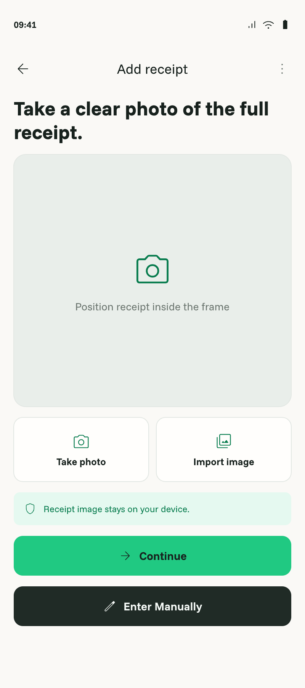
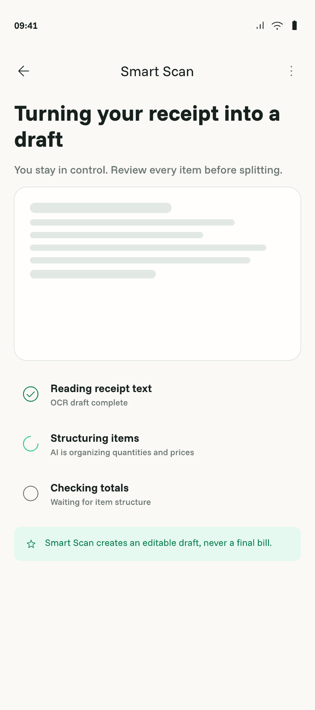
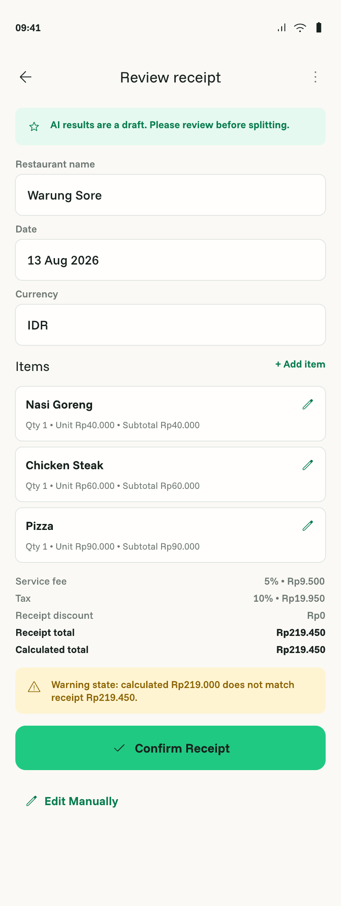

# Smart Scan

- Status: Approved
- Owner: Human
- Last updated: 2026-08-20

## Context

Smart Scan accelerates receipt entry but cannot be required for splitting. It covers Receipt Capture, Smart Scan loading, and Receipt Review in `billslice.pen`. The image stays on-device; `:core:ocr` extracts text with unbundled ML Kit; `:core:network` sends OCR text to `POST /smart-scan/parse`; `:core:data` implements the domain repository; `:feature:bill` owns UI/session state ([`ARCHITECTURE.md`](../../ARCHITECTURE.md)).

## Outcome

Users can capture or import a receipt, see transparent OCR/cloud progress, receive an editable confirmed draft, and recover through retry or manual entry from every permission, model, OCR, quota, network, or parse failure without uploading the image.

## Reference screens

| Receipt Capture | Smart Scan loading | Receipt Review |
|---|---|---|
|  |  |  |

These exports show the successful phone journey. Permission denial, quota, cancellation, offline, retry, and other failure states are required by this specification even where the Pencil artifact does not show a separate frame.

## User scenarios

- Capture/import succeeds → OCR text → backend draft/warnings → editable Review → explicit confirmation.
- Camera permission denied, OCR/model/network/backend fails, or quota is exhausted → actionable state with manual entry always available.
- Corrupt/unreadable image or empty/unusable OCR → local failure before backend submission, with retry and manual entry available and no quota consumed.
- User cancels capture, import, or loading → neutral outcome, no duplicate request, no persisted OCR/image, predictable return.
- A response is lost after a valid parse → explicit retry reuses the request ID and replays the same result without another AI call or quota use.

## Functional requirements

- `FR-001` — Capture supports camera and supported system image import; camera permission is requested only after choosing camera, denial does not affect import/manual entry, and corrupt, unsupported, or unreadable images fail locally before OCR/backend work.
- `FR-002` — Receipt images remain on-device and are not sent to backend, stored in History, or logged.
- `FR-003` — Unbundled ML Kit OCR is the initial adapter behind `ReceiptOcr`; model-download, recognition, empty/unusable text, cancellation, and unexpected failures are typed. Empty/unusable OCR stops locally, sends nothing, and consumes no quota.
- `FR-004` — Only request ID, install ID, locale, currency, timezone, and OCR text may be sent over HTTPS to `POST /smart-scan/parse`. One opaque request ID represents one active scan, is scoped to its install ID, and is reused for its explicit retries.
- `FR-005` — Backend authoritatively enforces five Free Smart Scans per `Asia/Jakarta` calendar month using server time and returns the dynamic reset/quota outcome. One quota use is consumed atomically only after a structurally valid, usable editable draft is produced, and at most once per request ID; warnings/uncertain fields may remain, but failures and unusable drafts consume no quota. Unavailable quota/entitlement verification fails closed for Smart Scan without blocking Manual Item Entry.
- `FR-006` — Full OCR text is not persisted or logged by default on device or backend; secrets never enter app source/logs/tests/artifacts. For idempotency, successful structured result data may be retained outside logs for at most one hour, then cleared; the opaque request/count marker may remain with minimal quota usage data so the request can never be charged twice.
- `FR-007` — Loading communicates OCR, structuring, and total-checking steps, prevents duplicate submissions, supports neutral cancellation without a generic unexplained spinner, and offers only user-initiated full-scan retry. Retry reuses the active request ID; a completed request replays the same cached result without another AI call or quota use. After replay expiry it returns a typed expired outcome and requires a new scan, without reparsing or recharging the old request. Cancellation itself consumes no quota, but a valid parse already accepted by the backend remains counted and replayable while the session is active.
- `FR-008` — Success maps to a structured receipt draft plus warnings; every calculation input is editable and explicit confirmation is required before people/assignment.
- `FR-009` — Review validates malformed/invalid fields individually and never silently replaces them with zero or presents AI output as final.
- `FR-010` — Distinct failure states cover permission, import/image, model download, empty/unusable OCR, recognition, offline, timeout, server rejection, unavailable quota/entitlement verification, exhausted quota, malformed/unusable response, cancellation, and unexpected failure without raw exception copy.
- `FR-011` — Every terminal failure/quota state exposes Manual Item Entry; retry appears only when meaningful and preserves user-confirmed structured values.
- `FR-012` — Transient image references, request ID, and unconfirmed OCR text survive only as needed for the active local session and are not restored into long-term state. Configuration changes preserve the in-memory scan and request ID without restarting work; process death ends the scan and may lose a quota use if the backend already completed a valid parse.

## Business rules and invariants

Manual fallback and confirmation are mandatory. Image remains local; backend receives text only; no full OCR retention by default ([`PRODUCT.md`](../../PRODUCT.md), “Smart Scan”; [`docs/product-plan.md`](../product-plan.md), “Smart Scan” and “Backend Architecture”). Free quota is five successful usable parses per server-controlled `Asia/Jakarta` month with dynamic reset; idempotent retry never charges twice. Domain models remain exact/global-ready; parsing never calculates the authoritative split.

## States and failure behavior

Cover idle, permission request/denial, cancelled/corrupt/unreadable import or capture, model download, empty/unusable OCR, recognition, structuring, total checking, editable success with warnings, lost response/replay, quota-verification unavailable, quota exhausted, offline, timeout, server/malformed/unusable failure, cancellation, explicit retry, configuration change, process death, and unrecoverable configuration. Preserve coroutine cancellation and prevent duplicate submissions or quota consumption.

## UX requirements

Match the three Pencil screens and Review draft treatment in `DESIGN.md`. Manual entry stays visible. Progress uses step rows/skeletons. AI draft/privacy/warnings use explicit text and non-color cues. Test compact, large font, landscape, and expanded layouts.

## Data and boundary contracts

The exact request, response, warning, error, quota, idempotency, and retention wire contract is [`docs/contracts/smart-scan-api.md`](../contracts/smart-scan-api.md); image never crosses `ReceiptOcr`. A valid response is structurally usable when it contains an editable draft with at least one usable item; warnings and individually editable uncertain fields do not invalidate it. Android/backend meet only at `:core:network`. Server owns OpenAI secret, prompt/schema, atomic quota persistence, one-hour successful-result replay, and minimal logs. Backend source/deployment availability is an implementation precondition, not permission to embed secrets.

## Acceptance criteria

- `AC-001` — Covers `FR-001`: Camera/import work; permission is narrow/recoverable; cancelled/corrupt/unsupported/unreadable input is handled locally; manual entry remains available.
- `AC-002` — Covers `FR-002`, `FR-004`, `FR-006`: Request/storage/log inspection proves image never leaves device, full OCR is not persisted/logged, successful structured result data expires within one hour, and only its opaque request/count marker remains with minimal quota data.
- `AC-003` — Covers `FR-003`, `FR-010`: OCR adapter tests cover success, model, recognition, empty/unusable text, cancellation, and failure without backend submission/quota use.
- `AC-004` — Covers `FR-004`, `FR-005`: Client/backend contract and concurrency tests cover allowed request fields, install-scoped request identity, server-controlled Jakarta reset, atomic five-scan quota, success-only consumption, warnings/usable drafts, verification failure, same-request replay/expiry, and typed errors.
- `AC-005` — Covers `FR-007`, `FR-010`, `FR-011`: Loading/failure UI tests prove steps, neutral cancellation, no duplicate, explicit same-ID retry/replay, quota states, and manual fallback.
- `AC-006` — Covers `FR-008`, `FR-009`: Parsed data is visibly editable, individually validated, and confirmation-gated.
- `AC-007` — Covers `FR-012`: Configuration-change tests preserve one active request without duplicate work; process-death/storage tests find no restored request ID, image, or unconfirmed OCR.
- `AC-008` — All three screens and key states pass actual-app adaptive/accessibility inspection.
- `AC-009` — Targeted OCR/network/domain/UI tests, compile, lint/build, CI, privacy review, and complete-diff review pass.

## Non-goals

Bundled OCR without measured approval, image upload/storage/gallery, OCR diagnostics opt-in, direct OpenAI calls, final bill math, manual split implementation, production entitlement hardening, or offline AI parsing.

## Assumptions

Use unbundled ML Kit first. Backend endpoint/test environment is supplied separately if source is not in this Android repository. Pro scan allowance is backend policy; Free is exactly five successful usable parses per server-controlled `Asia/Jakarta` month.

## Open decisions

None.

## Verification matrix

| Acceptance criterion | Evidence required | Proposed verification |
|---|---|---|
| `AC-001` | Capture/permission/input failures | Instrumented/UI tests and actual app |
| `AC-002` | Privacy/replay expiry | Request, storage, expiry, logs, diff inspection |
| `AC-003` | OCR outcomes/local rejection | Adapter tests with sanitized fixtures |
| `AC-004` | Client/backend/quota/idempotency | Fake-server, concurrency, and test-backend contract tests |
| `AC-005` | State machine/retry/fallback | ViewModel/coroutine/Compose tests |
| `AC-006` | Editable confirmation | Review UI/integration tests |
| `AC-007` | Lifecycle/transient retention | Configuration/process recreation and storage inspection |
| `AC-008` | UX | Phone/tablet actual-app evidence |
| `AC-009` | Gates/review | Gradle/Fastlane/CI and privacy-focused diff review |
